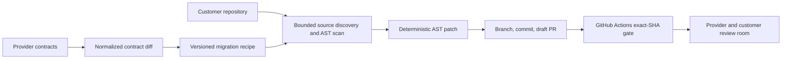

# Bridge

**Bridge is an API-change migration control plane.** It turns a breaking
provider contract change into a bounded code migration, a draft pull request,
an exact-commit CI result, and a human-reviewed handoff.

[Live product](https://bridge-nighthack.vercel.app) |
[Marketing site](https://usebridge.vercel.app) |
[Submission evidence](SUBMISSION.md) |
[Public source](https://github.com/coderarush/bridge-nighthack)

## What Bridge Does

For the verified AtlasPay fixture, Bridge:

1. compares the provider's old and new OpenAPI contracts;
2. applies a controlled TypeScript recipe to guarded request call sites;
3. creates deterministic AST edits without an LLM on the write path;
4. commits the patch and opens a draft pull request;
5. accepts GitHub Actions evidence only for the exact current PR-head SHA; and
6. coordinates provider and customer review in a run-scoped live room.

Bridge never auto-merges. The migration is proposed by software and accepted by
evidence plus human review.

## Verified Demo

The public demo uses AtlasPay, a fictional provider fixture, and
[`coderarush/atlas-store-demo`](https://github.com/coderarush/atlas-store-demo)
as the controlled customer repository.

| Evidence | Verified artifact |
| --- | --- |
| Breaking change | `POST /payments`: `payment_method` -> `payment_method_id` |
| Red base | [Expected three TypeScript failures](https://github.com/coderarush/atlas-store-demo/actions/runs/30142332724/job/89637894855) |
| Bounded patch | [Draft PR #1, three files, +3/-3](https://github.com/coderarush/atlas-store-demo/pull/1) |
| Exact head | `52ee5c54ccfa3831807eba894fc08372530d1fe9` |
| Green validation | [Successful build for the exact head](https://github.com/coderarush/atlas-store-demo/actions/runs/30142535151/job/89638422640) |
| Review room | [Capability-gated migration room](https://bridge-nighthack.vercel.app/room/f1386415-3de2-41ad-b499-36261d2eec91) |

The room requires a private participant capability by design. Judges do not
need a GitHub token, Supabase key, Vercel account, or local checkout.

## Architecture



The production foundation also includes workspaces, memberships, forced RLS,
encrypted GitHub installation references, GitHub App setup/callback routes,
durable jobs, fenced leases, attempts, audit logs, and forward-only Supabase
migrations.

## Repository Map

| Path | Purpose |
| --- | --- |
| [`prebuilt/bridge-app`](prebuilt/bridge-app) | Next.js product, API routes, deterministic migration engine, Supabase migrations, and tests |
| [`prebuilt/atlas-store-demo`](prebuilt/atlas-store-demo) | Controlled customer fixture and GitHub Actions workflow |
| [`SUBMISSION.md`](SUBMISSION.md) | Public links, judge procedure, and final evidence |
| [`DISCLOSURE.md`](DISCLOSURE.md) | Exact pre-existing versus NightHack work boundary |
| [`18_PRODUCTION_ARCHITECTURE_AND_JUDGE_QA.md`](18_PRODUCTION_ARCHITECTURE_AND_JUDGE_QA.md) | Tenant model, security invariants, and technical Q&A |
| [`09_DEMO_SCRIPT_AND_RUNBOOK.md`](09_DEMO_SCRIPT_AND_RUNBOOK.md) | Read-only demo and recovery procedure |

## Run Locally

Requirements: Node.js 22 or newer, npm, and Supabase/GitHub credentials for
live integrations.

```bash
cd prebuilt/bridge-app
npm ci
cp .env.example .env.local
npm test
npm run typecheck
npm run build
npm run dev
```

Fill only the variables needed for the surface you are testing. Never commit
`.env.local`. See
[`12_DEPLOYMENT_SECURITY_AND_ENV.md`](12_DEPLOYMENT_SECURITY_AND_ENV.md) for
the environment and permission model.

The final application snapshot discovered 219 Node tests: 218 passed and one
Docker-only Postgres test was skipped when the local Docker daemon was
unavailable. Typecheck, production build, dependency audit, PGlite migration
execution, production migration application, and live release probes passed.

## Scope

The verified migration remains intentionally narrow: one fictional provider,
one guarded request-property rename, one TypeScript repository, one draft PR,
and human approval. The later production foundation is real, but arbitrary-team
migration execution is not yet enabled: GitHub consent/callback and
installation-token repository access still need end-to-end verification, the
legacy demo run graph needs workspace ownership, lifecycle reconciliation is
not deployed, and no durable worker is running.

The preserved run was produced by `3407bf9`. The deployed application boundary
is `21fa19c`. See [`DISCLOSURE.md`](DISCLOSURE.md) before attributing work to the
NightHack build window.
